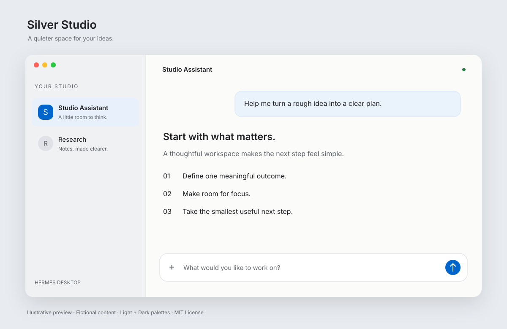

[English](README.md) | [简体中文](README.zh-CN.md)

# Hermes Desktop Theme — Silver Studio

A macOS-inspired light and dark theme for **official Hermes Desktop**. Version **1.2.0** combines a crisp white canvas, cool silver sidebar, dark graphite text and blue accents, with system fonts, glass-inspired highlights and subtle shadows.



*Illustration, not an application screenshot.*

## Appearance

The palette follows the app's light/dark mode. Assistant prose uses a relaxed 1.65 line height and a 72ch reading limit; code and tables keep their available width. Sessions and Bots share the same sidebar treatment. User messages scroll with the conversation instead of sticking to the top. The composer stays visible while scrolling and becomes opaque when focused. Glass effects are decorative CSS styling; this does not implement Apple’s Liquid Glass rendering. Reduced-transparency preferences are respected.

The plugin changes visual styling; it does not add Bot features, repair collapsed sidebars or provide message recovery controls.

## What changed in 1.2.0

- Restored a clear white canvas with stronger text contrast and cool silver surfaces.
- Unified Sessions and Bots glass styling, including empty Bot views.
- Added highlighted capsule tabs and a softly elevated composer.
- Removed sticky user prompts and their height clipping in normal chat; HUD layout stays separate.

## Install

Tested on macOS with Hermes Desktop **v0.21.1**. Hermes One and other operating systems have not been verified. Hermes must support desktop plugins; its runtime provides `@hermes/plugin-sdk`.

1. Download this repository using **Code → Download ZIP** and extract it, or clone it:

   ```sh
   git clone https://github.com/wukangcheng1994/hermes-desktop-theme-silver.git
   cd hermes-desktop-theme-silver
   ```

2. From the extracted repository folder, copy `plugin.js` into your Hermes plugin directory:

   ```sh
   mkdir -p "${HERMES_HOME:-$HOME/.hermes}/desktop-plugins/silver-studio"
   cp plugin.js "${HERMES_HOME:-$HOME/.hermes}/desktop-plugins/silver-studio/plugin.js"
   ```

   The destination is `$HERMES_HOME/desktop-plugins/silver-studio/plugin.js`, or `~/.hermes/desktop-plugins/silver-studio/plugin.js` when `HERMES_HOME` is not set. Reinstalling replaces the previous theme file at that location.

3. Open **Settings → Appearance** and select **Silver Studio · 银境**. If it is missing, press **⌘K**, run **Reload desktop plugins**, then open Appearance again; restart Hermes if necessary.

## Updates and compatibility

Silver Studio is an independent plugin stored in your Hermes home directory, outside the application bundle. Ordinary Hermes Desktop app updates normally preserve that plugin directory. However, future changes to the plugin SDK, theme variables or interface CSS may require a theme update. Compatibility has been verified only on macOS with Hermes Desktop **v0.21.1**; future versions are not guaranteed.

To update the theme, download the latest repository or release, repeat the file-copy step above, and reload desktop plugins or restart Hermes. If an app update changes the appearance or prevents the theme from loading, select another theme and report the Hermes version and symptoms in an Issue.

The maintainer's local Hermes sidebar and message recovery fixes are changes to the application itself and are **not included in this theme**. An app update may overwrite those local fixes independently of the theme.

## Remove

Select another theme, remove only the `silver-studio` folder from your Hermes `desktop-plugins` directory, then reload desktop plugins or restart Hermes.

## Check

With Node.js installed, run `node check.mjs` (or `npm test`). No dependencies to install. The check covers selected light/dark text contrast pairs, theme registration and style cleanup using a mocked host; it is not a full application UI test.

## Contributing

Issues and pull requests are welcome: colors, accessibility, compatibility and documentation. Fork this repository and submit a pull request; maintainers review changes before merging. See the [contribution guide](CONTRIBUTING.md).

## License

[MIT](LICENSE) © 2026 wukangcheng1994. Independent community theme, inspired by macOS; not affiliated with or endorsed by Apple or Nous Research. No Apple fonts or other proprietary assets are bundled.
