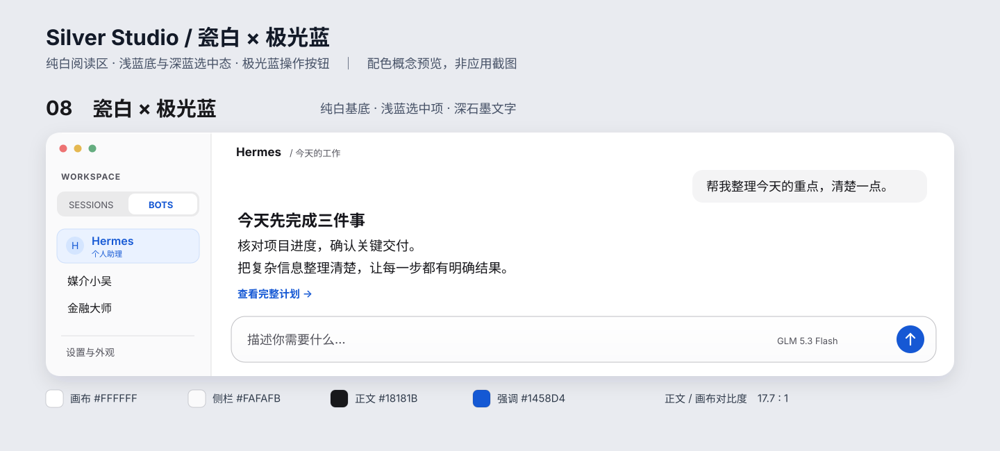

[English](README.md) | [简体中文](README.zh-CN.md)

# Hermes 桌面主题 — Silver Studio · 银境

为 **官方 Hermes Desktop** 设计的 macOS 风格明暗主题 / 外观皮肤。**v1.2.0** 采用清晰的纯白画布、清冷浅银侧栏、深石墨文字与蓝色点缀，配合系统字体、玻璃高光和轻阴影。


*上图是主题示意图，并非应用截图。*

## 新增皮肤：瓷白极光

**Porcelain Aurora · 瓷白极光** 是独立新皮肤，原版 **Silver Studio · 银境** 保持不变，两套可同时安装。

纯白聊天区、中性瓷白侧栏、浅蓝选中底与极光蓝文字；保留玻璃模糊、高光和气泡滚动布局。移除侧栏蓝色渐变，降低背景透色。暗色模式沿用银境的深色配色。已在 macOS Hermes Desktop **v0.21.2** 检查实际浅色显示。



*这是配色与布局示意图，并非应用截图；实际布局由 Hermes 决定。*

从本仓库目录安装：

```sh
mkdir -p "${HERMES_HOME:-$HOME/.hermes}/desktop-plugins/porcelain-aurora"
cp porcelain-aurora/plugin.js "${HERMES_HOME:-$HOME/.hermes}/desktop-plugins/porcelain-aurora/plugin.js"
```

然后在「设置 → 外观」选择 **Porcelain Aurora · 瓷白极光**。未出现时通过 ⌘K 执行 **Reload desktop plugins**。删除 `porcelain-aurora` 插件文件夹即可卸载此皮肤，原版不受影响。

这次新增的是完整版桌面插件，**尚未加入主题市场配色包**；不新增消息时间戳功能。

## 外观

配色跟随应用的明暗模式。回复正文采用 1.65 倍行距与 72ch 阅读宽度上限；代码和表格保留可用宽度。Sessions 与 Bots 使用一致的侧栏质感。用户消息随对话滚动，不再吸附在顶部；输入框滚动时保持可见，聚焦后使用实色背景。玻璃效果由 CSS 实现，并非 Apple Liquid Glass 原生渲染；支持系统的减少透明度偏好。

插件负责外观样式，不提供 Bot 功能、侧栏收起修复或消息恢复操作。

## 1.2.0 更新

- 恢复清晰的纯白画布，增强文字对比度，搭配冷银色表面。
- 统一 Sessions 与 Bots 的玻璃样式，包括 Bot 空白状态。
- 增加胶囊标签高光与轻盈的悬浮输入框。
- 普通聊天中取消用户消息吸顶及高度裁切，HUD 布局单独保留。

## 安装

已在 macOS 的 Hermes Desktop **v0.21.1** 验证。Hermes One 与其他操作系统尚未验证。需要支持桌面插件的 Hermes 版本；`@hermes/plugin-sdk` 由应用提供。

1. 点击仓库的 **Code → Download ZIP**，下载并解压，或克隆仓库：

   ```sh
   git clone https://github.com/wukangcheng1994/hermes-desktop-theme-silver.git
   cd hermes-desktop-theme-silver
   ```

2. 在解压后的仓库目录运行以下命令，将 `plugin.js` 复制到 Hermes 插件目录：

   ```sh
   mkdir -p "${HERMES_HOME:-$HOME/.hermes}/desktop-plugins/silver-studio"
   cp plugin.js "${HERMES_HOME:-$HOME/.hermes}/desktop-plugins/silver-studio/plugin.js"
   ```

   目标为 `$HERMES_HOME/desktop-plugins/silver-studio/plugin.js`；未设置 `HERMES_HOME` 时默认为 `~/.hermes/desktop-plugins/silver-studio/plugin.js`。重复安装会覆盖该位置的旧版主题文件。

3. 打开「设置 → 外观」，选择 **Silver Studio · 银境**。未出现时按 **⌘K**，执行 **Reload desktop plugins** 后重新打开外观设置；必要时重启 Hermes。

## 更新与兼容性

银境是独立插件，存放在 Hermes 用户目录中，而非应用包内。普通 Hermes Desktop 应用更新通常会保留此插件目录。但未来插件 SDK、主题变量或界面 CSS 的变化，可能需要更新皮肤进行适配。目前仅验证了 macOS 的 Hermes Desktop **v0.21.1**，不能保证所有后续版本都兼容。

更新皮肤时，下载最新仓库或发布版，重新执行上面的文件复制步骤，然后重新加载插件或重启 Hermes。如果应用更新后外观异常或主题无法加载，可先切换到其他主题，再通过 Issue 提供 Hermes 版本与问题现象。

维护者本机的侧栏与消息恢复修复属于 Hermes 应用本身的改动，**不包含在这套皮肤中**。应用更新可能覆盖这些本机修复，与皮肤文件是否保留是两回事。

## 卸载

先切换到其他主题，再仅删除 Hermes `desktop-plugins` 目录下的 `silver-studio` 文件夹，重新加载插件或重启应用。

## 检查

安装 Node.js 后运行 `node check.mjs`（或 `npm test`），无需安装依赖。检查明暗主题的主要文字对比度、主题注册及样式清理；使用模拟宿主，不代表完整应用界面测试。

## 一起维护

欢迎通过 Issue 反馈问题或建议，也欢迎 Fork 后提交 Pull Request，一起完善配色、可读性、兼容性与文档。改动由维护者审核后合并。详见[贡献指南](CONTRIBUTING.zh-CN.md)。

## 许可

采用 [MIT 许可证](LICENSE)，© 2026 wukangcheng1994。独立社区主题，受 macOS 风格启发，非 Apple 或 Nous Research 官方作品，亦未获得其背书。未附带 Apple 字体或其他专有素材。

## 主题市场版本

已准备[主题市场安装包](marketplace/README.zh-CN.md)，用于 Hermes 内置主题搜索，v1.2.0 已提交到 Visual Studio Marketplace，正在等待市场验证；验证和搜索索引完成后才能在 App 中搜到。该版本提供浅色和深色配色，不包含桌面插件的玻璃 CSS 或聊天布局调整。
